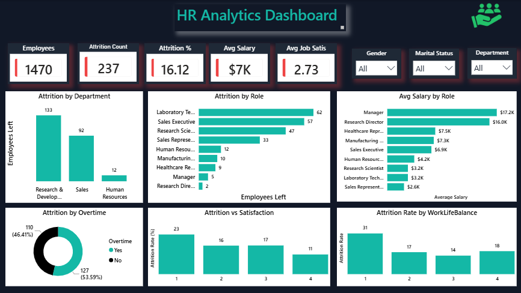
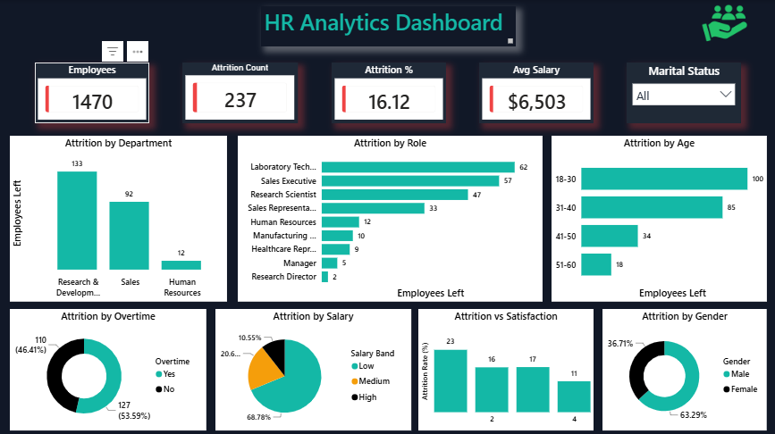
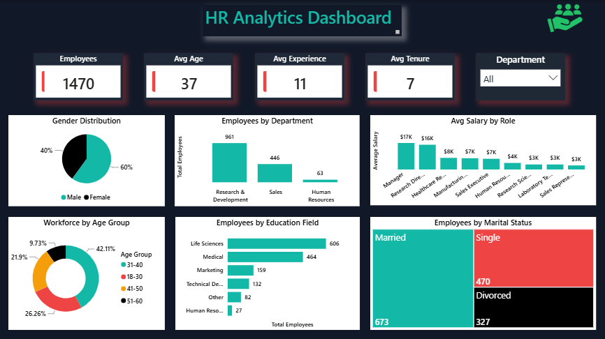
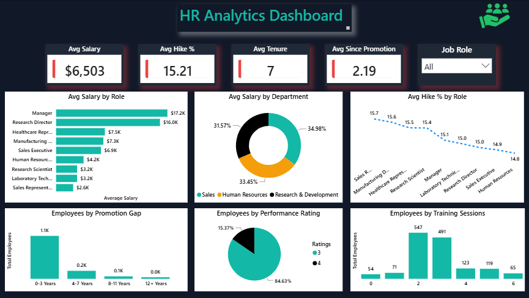
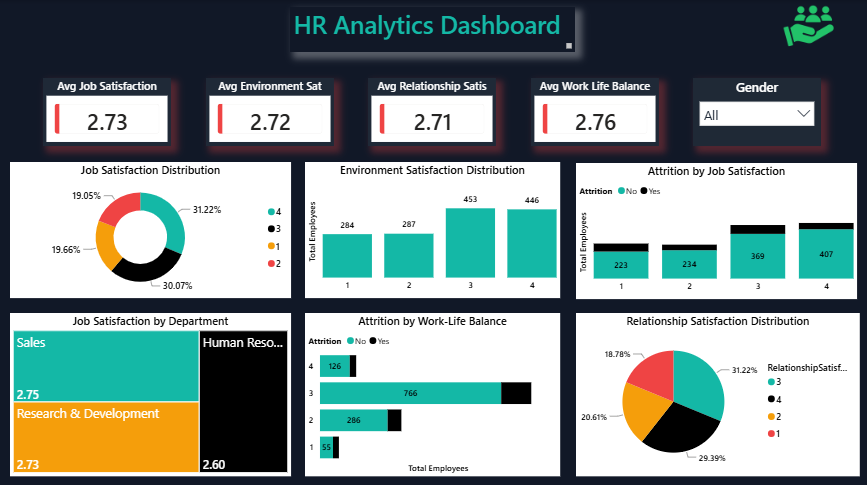

# HR Employee Attrition Analytics

## Project Overview

This end-to-end HR Analytics project analyzes employee attrition, workforce demographics, compensation trends, employee satisfaction, and career growth factors using SQL, Python, Power BI, and Excel.

The primary objective of this project is to identify key drivers of employee attrition and provide actionable business insights that can help organizations improve employee retention and workforce management.

---

## Tools & Technologies Used

* MySQL
* Python (Pandas, NumPy, Matplotlib)
* Power BI
* Microsoft Excel

---

## Dataset Overview

| Metric          | Value  |
| --------------- | ------ |
| Total Employees | 1,470  |
| Employees Left  | 237    |
| Attrition Rate  | 16.12% |

---

## Project Workflow

### 1. Data Preparation

* Cleaned and validated employee data.
* Performed Exploratory Data Analysis (EDA) using Python.
* Created employee segments based on age, salary, promotion gap, and satisfaction scores.

### 2. SQL Analysis

Conducted 21 business-focused analyses covering:

#### Attrition Analysis

* Overall Attrition Rate
* Department-wise Attrition
* Job Role-wise Attrition
* Overtime Impact on Attrition
* Age Group Attrition
* Salary Group Attrition
* Promotion Gap Analysis
* Marital Status Analysis
* Work-Life Balance Analysis

#### Workforce Demographics

* Employee Distribution by Department
* Gender Distribution
* Education Field Distribution

#### Compensation Analysis

* Average Salary by Department
* Average Salary by Job Role
* Education Level vs Salary

#### Satisfaction & Experience Analysis

* Job Satisfaction by Department
* Work-Life Balance by Department
* Experience by Department
* Average Employee Tenure
* Job Role-wise Tenure

### 3. Power BI Dashboard

Developed an interactive multi-page dashboard consisting of:

* Attrition Analysis
* Workforce Overview
* Compensation & Career Growth
* Satisfaction & Engagement
* Executive Summary

---

# Key Business Findings

## Employee Attrition

* Overall attrition rate is 16.12%.
* Sales department records the highest attrition rate (20.63%).
* Sales Representatives experience the highest attrition rate among all job roles (39.76%).
* Employees working overtime show an attrition rate of 30.53%, nearly double the company average.
* Employees aged 18–30 exhibit the highest attrition rate (25.91%).
* Low-income employees show the highest attrition rate (21.76%).
* Single employees have the highest attrition rate (25.53%).
* Employees reporting poor work-life balance (Rating 1) have the highest attrition rate (31.25%).

## Workforce Demographics

* Research & Development is the largest department in the organization.
* Life Sciences is the most common employee education field.
* Male employees account for approximately 60% of the workforce.

## Compensation Analysis

* Sales department offers the highest average monthly salary.
* Managers and Research Directors receive the highest average compensation.
* Higher education levels are associated with higher salaries.

## Satisfaction & Experience

* Sales department reports the highest average job satisfaction score.
* Human Resources records the highest work-life balance score.
* Human Resources has the most experienced workforce.
* Employees stay with the company for an average of 7 years.
* Managers and Research Directors demonstrate the longest average tenure.

---

# Business Recommendations

* Reduce excessive overtime dependency.
* Improve retention strategies for Sales employees and Sales Representatives.
* Review compensation structures for lower-income employee groups.
* Strengthen work-life balance initiatives.
* Develop targeted retention programs for younger employees.
* Enhance employee engagement and satisfaction programs.

---

# Executive Summary Dashboard



---

# Dashboard Screenshots

## 1. Attrition Analysis



---

## 2. Workforce Overview



---

## 3. Compensation & Career Growth



---

## 4. Satisfaction & Engagement



---

## 5. Executive Summary


---

# Repository Structure

```text
HR-Employee-Attrition-Analytics
│
├── Employees.csv
├── HR_Analytics_EDA_Python.ipynb
├── HR_Analytics_SQL_Project.sql
├── HR_Analytics_Dashboard.pbix
├── Attrition_Analysis.png
├── Workforce_Overview.png
├── Compensation_Career_Growth.png
├── Satisfaction_Engagement.png
├── Executive_Summary.png
└── README.md
```

---

# Project Highlights

✔ End-to-End Data Analytics Project

✔ SQL-Based Business Analysis

✔ Python Exploratory Data Analysis (EDA)

✔ Interactive Power BI Dashboard

✔ Workforce, Compensation & Attrition Insights

✔ Executive-Level Reporting

---

## Author

**Rahul Chhabra**

Aspiring Data Analyst skilled in SQL, Python, Power BI, and Excel.

### Connect with Me

LinkedIn:
https://www.linkedin.com/in/rahulchhabra-data-analyst

GitHub:
https://github.com/ssdnrahul
